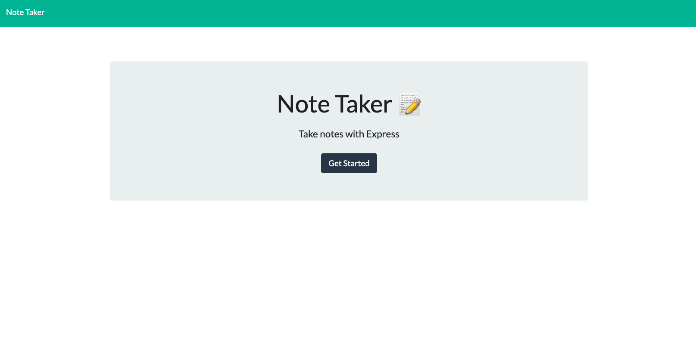
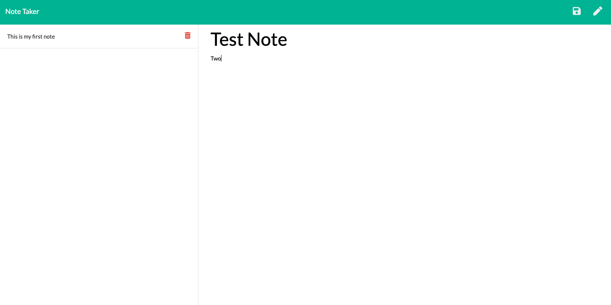
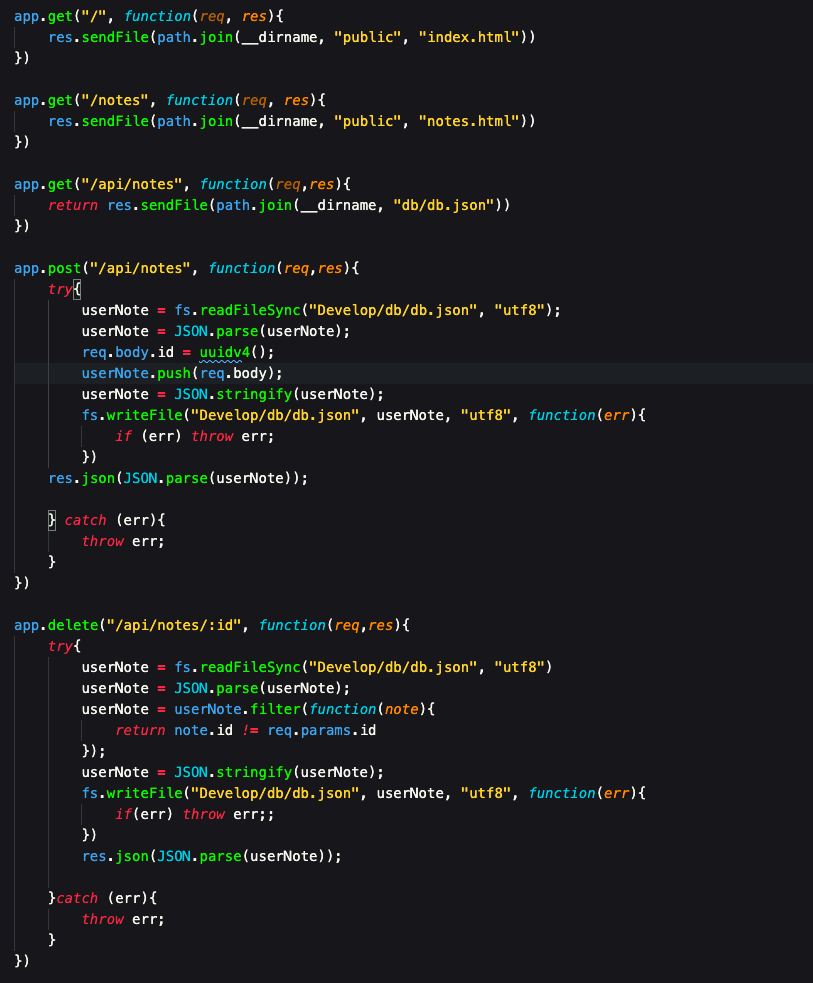
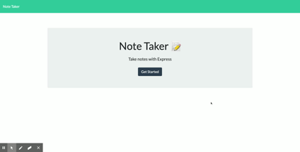

# note-taker-application
In this note taker app, users can add, edit and delete notes.

In this activity we were required to set up a server and create _get_, _post_ and _delete_ routes to take in user data to our server and respond with the corresponding response. 

Additionally, it was the first time we were required to deploy to Heroku. This project runs on an Express and is served via Node and Express. Please feel free to read through below. 

## Table of Contents
* [Challenges](##Challenges)
* [Images](##Images)
* [Contributors](##Contributors)
* [Installation](##Installation)
* [Licensing](##Licensing)
* [Links](##Links)

## Challenges

An issue that I had (and really only comprehended until after completion) was that my folder structure prevented me from running deploying to Heroku at first, and then later when deployed on Heroku, prevented me from running effectively on local host. While, my server.js runs out of the Develop folder, the entire repository is pushed to GitHub and Heroku, meaning that the paths that worked on my local were resulting in routes that didn't hit on Heroku. 

THis resulted in needing to move some files around, and making sure to include the package.json and package-lock in the directory so that Heroku would be able to find them. 

Ultimately, I'm glad to have run into this problem early, so that as I move toward more and more complex project, I'll be cognizant of my file structure.

## Images 

#### Homepage
Screenshot of the App Homepage

#### Notes Page
Screenshot of the Note Edit page

#### Routes
Screenshot of the routes in the server.js file

#### Demo
A brief demo of the app at work

## Contributors
I completed this project with the aid of my fellow students at the Georgia Tech Coding Boot Camp and under the guidance of my fantastic tutor. 

## Installation

This app had the following dependencies:

* Express
* Nodemon
* npm-watch
* uuid

However, the website is hosted on Heroku and users will __not__ have to install these dependencies themselves.

## Licensing
This project is covered by the MIT license.

## Links

#### Repository Link
https://github.com/ad-fleming/note-taker-application
#### Deployed Site
https://note-taker-102020.herokuapp.com/

